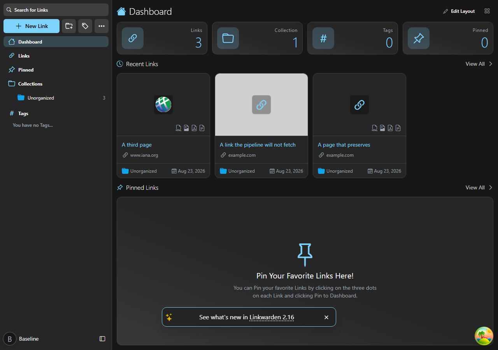

# linkwarden-akka

Takes a saved web link, decides which copies of the page to keep, makes them, records what
each attempt produced, and tries again when an attempt fails.

A port of [linkwarden/linkwarden](https://github.com/linkwarden/linkwarden) onto **Akka**,
built with **Akka Specify**.



---

## Where it came from

linkwarden is a self-hosted place to save, organise and keep copies of web pages. It was
ported to derive a specification format precise enough to regenerate a system on a
different stack — the port is the vehicle, the specification is the deliverable.

The specifications the port was generated from are in
[TylerJewell/akka-specify-harness](https://github.com/TylerJewell/akka-specify-harness)
under `linkwarden-port/`.

---

## linkwarden/linkwarden → this port

📉 778 TypeScript lines → **1,259 Java lines**<br>
📁 12 files → **26 files**<br>
🧪 0 tests over this behaviour → **51 tests**<br>
⚡ 76,331 nanoseconds per decision → **667 nanoseconds per decision**<br>
🎯 18 of 18 workloads agreeing → **18 of 18**<br>
🔁 0 retries after a failed attempt → **3 retries**<br>
💾 not measured → **not measured**

Full method and the numbers that did *not* make this list:
[`bench/REPORT.md`](https://github.com/TylerJewell/akka-specify-harness/blob/main/linkwarden-port/bench/REPORT.md).

---

## What it took to build

⏱️ **1.8 hours** from the first command to the published repository, **1.8** of them active<br>
💬 **423** exchanges with the model<br>
✍️ **377,954** tokens written by the model, **126,232,610** counting everything sent and re-sent<br>
🙋 **0** questions to a human<br>
🧪 **51** tests

```bash
python toolkit/tokens.py --port linkwarden    # turns, tokens, elapsed and active time
```

The record of every question, and where the time went, is in
[`port-log/`](https://github.com/TylerJewell/akka-specify-harness/tree/main/port-log).

---

## What it does

From the specification:

- **A link is picked up when it has an address and has never been through the pipeline.**
  One field decides it, so asking for a page to be kept again is a single write.
- **A tag with any archival setting on it decides for the whole link.** A tag that turns
  every format off turns every format off, and the person who owns the link is not
  consulted.
- **What the page answered with decides what is kept.** A page answering as a PDF has its
  PDF saved and is never opened in a browser; one answering as an image has the image
  saved and a small copy made from it.
- **A format that already holds an answer is not asked again.** The word `unavailable` is
  an answer, so a page that could not be turned into readable text is not retried for that
  one format on the next attempt.
- **Every format still unanswered when an attempt ends is recorded as unavailable.** That
  happens on the failing path as well as the succeeding one, so nothing is left looking
  like it is still being worked on.
- **An attempt that fails is tried again three times, waiting longer each time.** A page
  that was briefly unreachable ends up kept rather than permanently marked as impossible.

---

## Design decisions

**Per-link workflow.** Each link gets its own small program that remembers how far it got,
so if the machine stops halfway through nothing is lost and nothing is done twice. That
means a page interrupted at the third of five steps carries on from the third step rather
than starting again.

**Waiting longer after each failure.** A page that fails is retried after five seconds,
then ten, then twenty, rather than immediately. A site that is briefly down gets a second
chance without being hammered while it is struggling.

**One record of everything that happened to a link.** Every answer the pipeline produced
is appended to a list that is never rewritten, rather than overwriting a row. Anyone can
ask what was tried, in what order, and what came back.

**A separate list for reading.** The questions "which links still need doing" and "which
still need indexing" are answered from a list kept up to date as things happen, not by
searching everything each time. Asking is cheap no matter how many links there are.

**The page itself is given, not fetched.** Whatever a browser, a search engine and a file
store would have answered is handed to the pipeline rather than produced by it. That makes
the decisions testable without a browser, and it is why every number in the comparison
above is about deciding rather than about downloading.

---

## Running it — the short path

You do not need Java, Maven, or the Akka CLI installed. Akka Specify installs them for you.

**1. Install Akka Specify** in Claude Code:

```
/plugin marketplace add akka/ai-marketplace
/plugin install akka@akka-ai-marketplace
```

Restart Claude Code when it asks.

**2. Give it this prompt:**

> Clone https://github.com/TylerJewell/linkwarden-akka into a new directory and open it.
> Then run /akka:setup to install everything this project needs, and /akka:build to
> compile it, run the tests, and start it locally.

**3. Open** http://localhost:9077/dashboard.

---

## Running it — the developer path

### Requirements

- Java 21 or newer
- Maven 3.9 or newer
- An Akka download token — run `akka code token` once

### Start the service

```bash
mvn compile
akka local run
```

The service starts on **port 9077**.

### Start the screen

The interface under `frontend/` is linkwarden's own, with one file changed: the dashboard
reads its links from this service over a held-open connection instead of asking for them
again every few seconds.

```bash
cd frontend
yarn install
yarn workspace @linkwarden/web dev
```

It needs a database for the parts this port did not rebuild — signing in, collections,
tags. Point `DATABASE_URL` at any linkwarden database.

---

## Configuration

| Variable | Default | Notes |
|---|---|---|
| `linkwarden.retry.max-attempts` | `4` | how many times an attempt is made before the link is marked and left alone |
| `linkwarden.retry.base-delay` | `5s` | the first wait after a failure; each later wait is double the one before |
| `akka.javasdk.dev-mode.http-port` | `9077` | the port the service listens on |
| `NEXT_PUBLIC_DASHBOARD_STREAM_URL` | `http://localhost:9077/dashboard/stream` | where the screen gets its links |

---

## Where it differs from linkwarden/linkwarden

Everything not listed here behaves the same way on purpose, including the parts that look
like mistakes.

- **A failed attempt is tried again.** linkwarden records the link as done in the same
  block that reports the failure, so a page that could not be reached is marked exactly as
  a page with nothing to keep, and the only way back is a person asking for it again. This
  port tries three more times, waiting five, ten and twenty seconds, and marks the link the
  same way only once those are used up. It was chosen because the thing this port runs on
  makes a durable, resumable wait the cheap option rather than the expensive one, so
  keeping the original behaviour would have been copying a limit of where the original runs
  rather than something it decided.
- **A failed indexing attempt is tried again.** linkwarden catches the failure, ignores it,
  and records the link as indexed anyway, so nothing was indexed and nothing will be. This
  port records the link as indexed only when the index accepted it. Same reasoning as
  above.
- **The screen is fed by a held-open connection.** linkwarden's dashboard asks the server
  for its links again every few seconds while anything is still being worked on. This port
  sends an update when there is one. That changes what somebody can see: a change appears
  as soon as it happens rather than up to a few seconds later, and if the connection drops
  the page reopens it rather than quietly showing an old answer. The original never had to
  say what happens across a dropped connection, and this port had to be given an answer.
- **Copies of pages are not made.** linkwarden opens a browser, screenshots the page,
  prints it to a PDF, inlines it with an external program and extracts its text. This port
  is handed what those would have answered and decides what to do with it. Everything about
  which copies are made, in what order, and what is recorded is the same; the bytes are not
  produced.
- **Links are not searched.** linkwarden hands indexed links to a search engine. This port
  decides which links are due to be indexed and records the outcome, and hands them to
  nothing.
- **A batch is not a unit of work.** linkwarden takes a group of links and works through
  them together in one process. This port takes one link at a time, each with its own
  program. The rules about which links a batch would hold, and how a batch is shared
  between people, are rebuilt and compared, but nothing here processes several at once
  because one of them failing does not affect another.
- **Only the one screen was rebuilt.** The interface under `frontend/` is linkwarden's own
  and every other page on it still runs the way linkwarden runs it. Only the dashboard's
  list of links comes from this service.
- **The page's copies do not display.** The small images on the dashboard are files, and
  this port keeps the decision about where a file goes without keeping the file. The card
  shows the grey block linkwarden shows for a page whose copy is missing, in the two places
  where linkwarden would show a picture. Not checked against every screen — only the
  dashboard was compared.
- **Ordering by identity.** linkwarden orders links by the number its database gave them,
  which is also the order they were saved in. This port orders by when they were saved,
  with the identity breaking a tie. The two agree on every case compared; where a database
  hands out numbers out of order they would not, and that was not checked.
- **Submitting to the Internet Archive.** linkwarden sends the address to archive.org and
  does not read the answer. This port records that the setting is on and sends nothing.
- **Automatic tagging.** linkwarden can ask a language model to tag a link. This port does
  not — `not checked` against any of that behaviour.

---

## Licence

linkwarden is AGPL-3.0, © the Linkwarden authors. This port reimplements the behaviour
without copied source; the interface under `frontend/` is linkwarden's own and remains
under AGPL-3.0. See `ACKNOWLEDGEMENTS.md`.
